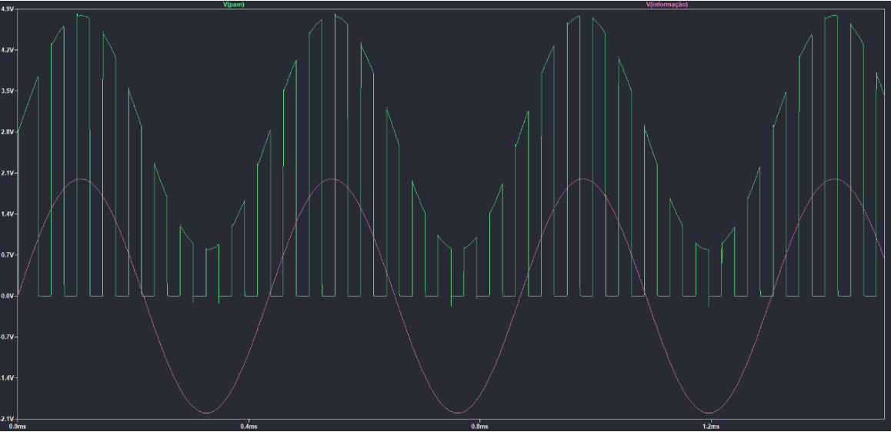

# PAM, PWM and PPM Modulation

 

    

  

  

  

Academic Work - Fundamentals of Telecommunications

You can see all the details of the problem and solution in "/doc/(DES)MODULACAO_PAM_PWM_PPM.pdf"

You must add the missing components to ltspice.  
They are in the LTspice Lib folder.

### 📷 Some Images (ltspice)

    
    
    
    
    
    

---

Esse projeto está sob a licença MIT. Veja o arquivo [LICENSE](https://github.com/git/git-scm.com/blob/master/MIT-LICENSE.txt) para mais detalhes.

---

Created with 💜 by <a href="https://www.linkedin.com/in/eduardoqueiros/">Eduardo Queirós</a> 👋
